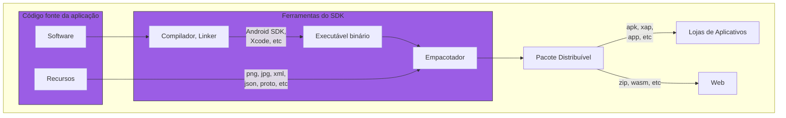
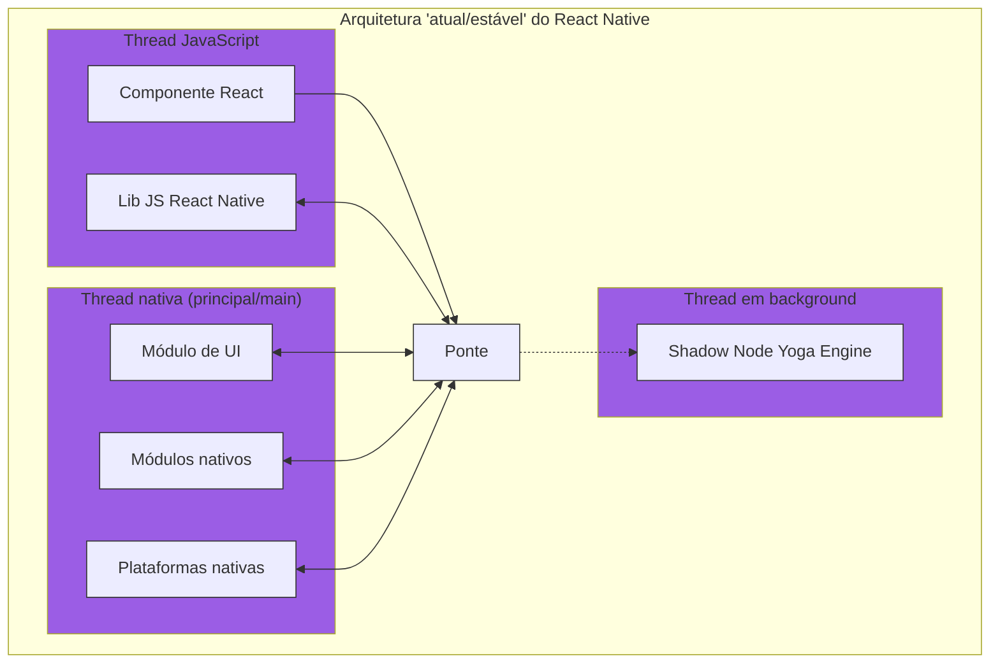
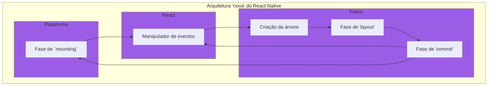
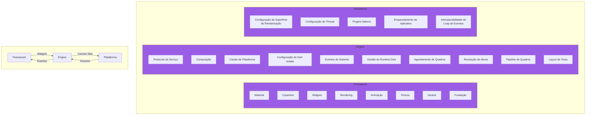
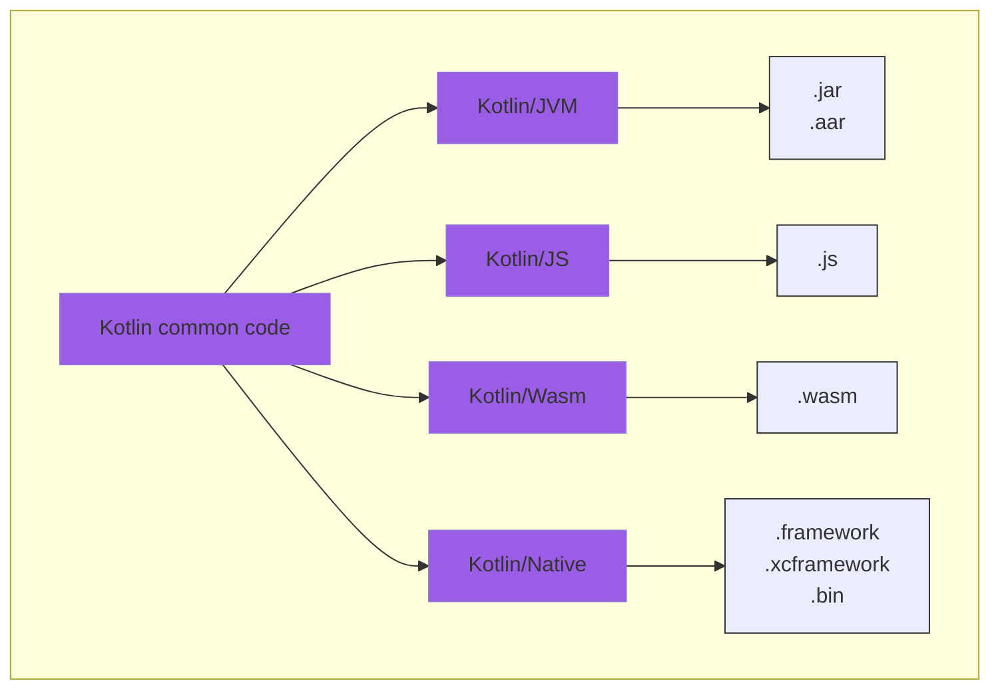
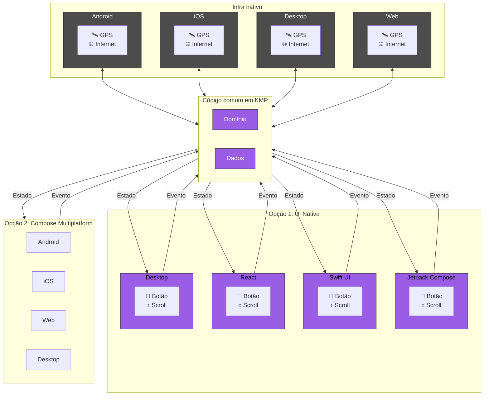

## Nativo, Cross-platforma e Multiplataforma

Diariamente, interagimos com uma variedade de aplicativos em nossos celulares, relógios, televisões e computadores, navegando por um
ecossistema vasto de plataformas digitais.

Essa diversidade de plataformas demanda uma estratégia de desenvolvimento que permita atualizações simultâneas e experiências de usuário
consistentes em todos os dispositivos.

O [Kotlin Multiplataforma (KMP)](https://kotlinlang.org/docs/multiplatform.html) surge como uma resposta a esse desafio, facilitando a
manutenção e a sincronização de aplicações como a Netflix, que devem funcionar de forma integrada em várias interfaces.

Antes de explorarmos a solução multiplataforma, é crucial entender as diferenças entre o desenvolvimento "nativo", "cross-platforma" e "
multiplataforma", cada um com suas próprias vantagens e desafios no ecossistema tecnológico atual.

---

## O que é desenvolver "nativo"?

Desenvolvimento nativo é a criação de aplicativos feitos para operar especificamente em uma plataforma, como Android, iOS, Desktop, Web,
tirando proveito de todas as suas capacidades.

Aplicativos nativos se integram perfeitamente com o hardware e seguem as diretrizes de design da plataforma, resultando em interfaces
responsivas e acesso imediato às últimas atualizações do sistema.

Cada fabricante de plataforma ou sistema operacional disponibiliza um kit de desenvolvimento de software (SDK), com os recursos necessários
para desenvolver aplicações específicas para aquela plataforma. Esse SDK é então utilizado para criar aplicações para uma única plataforma.

O desenvolvimento nativo enfrenta desafios como:

- Necessidade de adaptar-se a diversos ambientes e linguagens
- Gerenciar múltiplas base de código
- Lidar com a fragmentação de dispositivos, como tamanhos de tela e versões de sistema variados
- Requer atenção constante a novas atualizações dos sistemas operacionais
- Retrocompatibilidade para garantir o funcionamento em versões antigas;

A complexidade aumenta com a necessidade de dominar ferramentas e APIs específicas, resultando em uma manutenção mais trabalhosa.

> https://www.researchgate.net/publication/314165913_Decision_Framework_for_Mobile_Development_Methods

## Introduzindo frameworks cross-plataforma

Frameworks cross-plataforma como React Native e Flutter apresentam um SDK próprio, que pode atuar como uma camada adicional sobre o SDK
nativo.

É inegável a ascensão dessa solução no ecossistema de aplicativos. Usando dados do Flutter:

- **2021**: A Play Store alcançou um pico de 4,67 milhões de aplicativos na loja, dos quais mais de 150.000
  foram desenvolvidos com Flutter, representando cerca de 3.2% do
  total [[1](https://developers.googleblog.com/2021/03/announcing-flutter-2.html), [2](https://www.statista.com/statistics/289418/number-of-available-apps-in-the-google-play-store-quarter/)].
- **2022**: No terceiro trimestre de 2022, o número de aplicativos disponíveis caiu para 3,55 milhões, mas o número de aplicativos Flutter
  cresceu para 500.000, representando cerca de
  14.1% [[1](https://techcrunch.com/2023/05/10/with-over-1m-published-apps-googles-flutter-expands-its-support-for-web-apps-and-webassembly/?guccounter=1#:~:text=Google%20also%20noted%20that%20there,adopt%20Flutter%20in%20existing%20projects.), [2](https://www.statista.com/statistics/289418/number-of-available-apps-in-the-google-play-store-quarter/#:~:text=Google%20Play%3A%20number%20of%20available%20apps%20as%20of%20Q3%202022)].
- **2023**: A mais recente contagem disponível indica que há 2,87 milhões de aplicativos na Google Play Store, com mais de 1 milhão baseado
  em Flutter, sugerindo que quase 35% dos aplicativos na loja são desenvolvidos usando essa
  tecnologia [[1](https://bloggersideas.com/pt/apps-statistics/#:~:text=,de%20aplicativos%20dispon%C3%ADveis%20para%20download), [2](https://www.nomtek.com/blog/flutter-app-examples)].

### O que impulsiona a busca por soluções cross-plataforma?

A demanda por soluções cross-plataforma vem do desejo de simplificar o complexo processo de desenvolvimento de aplicativos para múltiplas
plataformas.

A necessidade de dominar linguagens e SDKs diferentes para cada plataforma, como Kotlin para Android e Swift para iOS, além das
constantes atualizações tecnológicas, impõe um grande desafio ao longo prazo.

Frameworks cross-plataforma, como Flutter e React Native, oferecem um caminho mais eficiente, permitindo o uso de um único código-base para
várias plataformas, economizando tempo e esforço significativos.

## React Native

[React Native](https://github.com/facebook/react-native) é um framework de código aberto que conecta o JavaScript e React com componentes
nativos para Android e iOS.

Essa metodologia é especialmente conveniente para devs com experiência no universo Web/React.

- Um componente `Text` no React Native é convertido em um `UITextView` no iOS.
- No Android, o mesmo componente `Text` se torna um `TextView`.

Atualmente, o React Native possuí 2 tipos de arquiteturas:
uma [atual e a nova](https://reactnative.dev/docs/next/the-new-architecture/landing-page).

### Arquitetura atual (estável)

Essa arquitetura funciona com 3 threads principais, essenciais para a execução de ambientes dentro do React Native:

1. Do JavaScript,
2. Da thread nativa principal, ou "main thread"
3. A thread de background que gerencia o Shadow Node.

A comunicação entre o código JavaScript e o código nativo é feita por uma biblioteca conhecida como "ponte" (bridge), que pode ser imaginada
como um terminal em que o emissor envia alguns dados para a camada do consumidor, podendo desserializá-los e executar as operações
necessárias.

#### Desafios da arquitetura antiga

1. **Assincronicidade**: a ponte opera de forma assíncrona, o que significa que uma camada submete dados e espera "asincronamente" que a
   outra camada os processe. Isso pode ser ineficiente quando a espera não é realmente necessária, resultando em atrasos desnecessários na
   atualização da UI.

2. **Single-threaded**: O código JavaScript é executado em uma única thread. Assim, qualquer computação realizada precisa ser feita nesta
   thread única, levando a bloqueios (tela congelada) e atrasos, especialmente em operações intensivas.

3. **Overheads adicionais**: Sempre que uma camada precisava interagir com a outra, é necessário serializar os dados a serem transferidos.
   Na outra extremidade, esses dados precisavam ser desserializados. O formato escolhido para essa transferência era o JSON, devido à sua
   simplicidade e legibilidade humana. No entanto, apesar do JSON ser considerado leve, o processo de serialização e desserialização
   adiciona uma sobrecarga computacional, impactando o desempenho.

> Referência: https://dev.to/goodpic/understanding-react-native-architecture-22hh

### A nova arquitetura

A nova arquitetura visa resolver esses problemas, permitindo que haja uma comunicação mais eficiente e direta entre as threads, eliminando a
necessidade de serialização/desserialização e aproveitando múltiplas threads para melhorar o desempenho.

O [Fabric](https://reactnative.dev/architecture/fabric-renderer) é uma reescrita completa da camada de renderização, permitindo que o React
Native interaja mais diretamente com as threads nativas.

- **JSI (JavaScript Interface)**: Uma camada de abstração mais leve que substitui a ponte, permitindo chamadas sincronizadas entre o
  JavaScript e o nativo.
- **TurboModules**: Módulos reescritos que utilizam o JSI para acesso direto e eficiente.
- **React Renderer**: Um novo renderizador que trabalha com o JSI para melhorar o desempenho da interface do usuário.

#### Benefícios do Fabric

- **Desempenho Aumentado**: Com a eliminação da necessidade de serialização e desserialização, a comunicação entre JS e nativo é muito mais
  rápida.
- **Chamadas Síncronas**: Permite atualizações de UI imediatas e animações mais suaves.
- **Menos Overhead**: A arquitetura simplificada reduz a carga computacional.

#### TurboModules

Os `TurboModules` aprimoram os `NativeModule` no React Native, superando limitações como a inicialização antecipada e a necessidade de
serialização de dados.

Essa abordagem permite que os módulos nativos sejam carregados sob demanda, por um proxy de "alto nível no JavaScript".

Essa abordagem resulta em um carregamento mais eficiente e uma inicialização mais rápida das funcionalidades nativas, pois os módulos são
carregados apenas quando são realmente necessários pelo aplicativo.

### Fase experimental

Essa nova arquitetura ainda é experimental e está sujeita a mudanças à medida que o projeto evolui.

É importante estar ciente de que a implementação atual inclui várias etapas manuais e não reflete a experiência final de desenvolvimento
prevista para a arquitetura renovada.

> Referências
>
> https://blog.logrocket.com/exploring-react-natives-new-architecture/
>
> https://dev.to/amazonappdev/a-guide-to-turbo-modules-in-react-native-5aa3
>
> https://reactnative.dev/docs/next/the-new-architecture/landing-page

## Flutter

[Flutter](https://github.com/flutter/flutter) é um kit de desenvolvimento de interface de usuário (UI toolkit e framework), de código
aberto, criado pela empresa Google em 2015, baseado na linguagem de programação Dart, que possibilita a criação de aplicativos compilados
nativamente, para os sistemas operacionais Android, iOS, Windows, Mac, Linux, Fuchsia e Web.

Do ponto de vista arquitetural, o Flutter possui três camadas – o framework, a engine e a plataforma – e se baseia em especificidades da
linguagem Dart, como a compilação ahead-of-time (AOT).

Como dev, você interage principalmente com o framework, escrevendo o aplicativo e os widgets (componentes da UI no Flutter) de
maneira declarativa usando Dart.

A engine, então, renderiza isso em uma tela usando o [Skia](https://github.com/google/skia), que é posteriormente enviada às plataformas
nativas: Android, iOS ou web. A plataforma nativa apresenta o canvas e envia os eventos que ocorrem de volta:

### Flutter vs React Native

Embora a arquitetura do Flutter seja semelhante à do React Native, há uma diferença significativa em termos de desempenho.

Um dos componentes-chave que permite ao Flutter alcançar um desempenho superior ao do React Native é a integração mais profunda com o lado
nativo, o que significa que ele não usa os SDKs tradicionais.

Em vez disso, o Flutter utiliza o Android NDK e o LLVM do iOS para compilar o código C/C++ que vem do engine.

#### Flutter vs a nova arquitetura do React Native

É importante ressaltar que não encontrei material comparando a nova arquitetura do React Native com o Flutter. Fica para um artigo do
futuro!

### Desvantagens do Flutter

Embora o Flutter tenha um desempenho satisfatório, superando o React Native em termos de compilação de Dart para código nativo, ele enfrenta
desafios como o tamanho aumentado dos aplicativos, devido à inclusão de seu motor de execução e widgets.

Além disso, a extensão de funcionalidades não suportadas nativamente pelo Flutter exige a comunicação entre Dart e as linguagens nativas por
meio de canais e estruturas de dados específicas, o que pode ser uma solução menos eficiente e mais complexa em comparação com a
interoperabilidade entre Java e Kotlin ou Objective-C e Swift.

> https://www.jacobras.nl/2023/09/android-ios-native-flutter-compose-kmp/
>
> *Compose Multiplataforma em iOS está em versão alpha

#### O desafio do Dart no Flutter

Como toda linguagem, Dart impõe um desafio natural de aprendizado e aplicação.

Embora o Dart seja uma linguagem moderna e dinâmica, é comum que devs de outras plataformas nativas possam encontrar uma barreira ao
adentrar neste novo ecossistema, como funcionalidades específicas de linguagens como Kotlin ou Swift.

Dart está constantemente se aprimorando e, embora possa não ter a mesma percepção de maturidade que linguagens estabelecidas, ela oferece
uma série de recursos interessantes que estão ganhando reconhecimento na comunidade de
desenvolvimento.

### Considerações finais sobre cross-plataforma

As soluções cross-plataforma abstraem as complexidades nativas, permitindo escrever um único código para diversos dispositivos.

Porém, é comum encontrar limitações ao se integrar com a plataforma nativa, impactando o desempenho e a experiência da aplicação.

Além disso, a adaptação a atualizações das plataformas pode ser lenta, pois o framework cross-plataforma precisa ser atualizado para
suportar novas funcionalidades nativas.

---

## Introduzindo o Kotlin Multiplataforma (KMP)

Para superar esses desafios, o Kotlin Multiplatform (KMP) apresenta uma nova abordagem, centrada na coexistência harmoniosa com o
desenvolvimento nativo.

Em vez de tentar abstrair completamente a plataforma nativa, o KMP empodera devs nativos com um maquinário open-source que trata de
compilar as aplicações para Android, iOS, Web, macOS, Windows, Linux entre outros.

O KMP visa:

- Manter o desenvolvimento de recursos específicos da plataforma tão natural e próximo quanto possível do desenvolvimento nativo.
- Assegurar que os desenvolvedores nativos não enfrentem dificuldades ao trabalhar com o código compartilhado.
- Facilitar a interoperabilidade entre o código nativo e compartilhado, tornando a interação com o código compartilhado intuitiva e
  familiar.

### Compartilhando código Kotlin com as plataformas

### 

Ao explorar o KMP, podemos nos beneficiar da eficiência do código compartilhado sem sacrificar a qualidade da experiência nativa. 
