# Kotlin Multiplataforma 101: Introdução ao paradigma da Multiplataforma

Usamos diariamente uma variedade de aplicativos em dispositivos como celulares, relógios, TVs e computadores, inseridos em um amplo
ecossistema digital.

Essa diversidade de plataformas exige estratégias de desenvolvimento que proporcionem atualizações simultâneas e
experiências de usuário uniformes.

O [Kotlin Multiplataforma (KMP)](https://kotlinlang.org/docs/multiplatform.html) surge como uma resposta a esse desafio, facilitando a
manutenção e a sincronização de aplicações como a Netflix, que devem funcionar de forma integrada em várias interfaces.

Antes de discutir a abordagem multiplataforma, é importante entender as diferenças entre desenvolvimento "nativo", "cross-platform" e "
multiplataforma", cada um com suas vantagens e desafios no cenário tecnológico atual.

---

## O que é desenvolver "nativo"?

Desenvolvimento nativo é a criação de aplicativos feitos para operar especificamente em uma plataforma, como Android, iOS, Desktop, Web,
tirando proveito de todas as suas capacidades.

Aplicativos nativos se integram perfeitamente com o hardware e seguem as diretrizes de design da plataforma, resultando em interfaces
responsivas e acesso imediato às últimas atualizações do sistema.

Para cada plataforma, os fabricantes fornecem um SDK (Kit de Desenvolvimento de Software) que facilita a criação de aplicações dedicadas.

Contudo, o desenvolvimento nativo implica desafios, como:

- Necessidade de se adaptar a diferentes ambientes e linguagens
- Gerenciar múltiplas base de código
- Lidar com a fragmentação de dispositivos, como tamanhos de tela e versões de sistema variados
- Requer atenção constante a novas atualizações dos sistemas operacionais
- Retrocompatibilidade para garantir o funcionamento em versões antigas

A complexidade aumenta com a necessidade de dominar ferramentas e APIs específicas, resultando em uma manutenção mais trabalhosa.

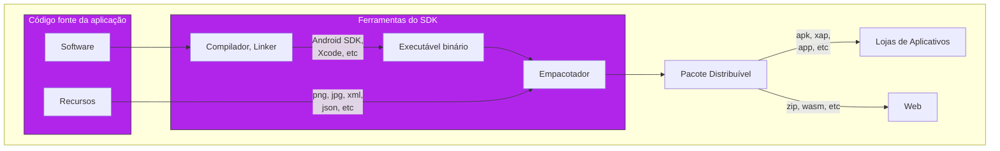

> [🔗 Decision framework for mobile development](https://www.researchgate.net/publication/314165913_Decision_Framework_for_Mobile_Development_Methods)

## Introduzindo frameworks cross-plataforma

Frameworks cross-plataforma como React Native e Flutter apresentam um SDK próprio, que pode atuar como uma camada adicional sobre o SDK
nativo.

É inegável a ascensão dessa solução no ecossistema de aplicativos. Usando dados do Flutter:

- **2021**: A Play Store alcançou um pico de 4,67 milhões de aplicativos na loja, dos quais mais de 150.000
  foram desenvolvidos com Flutter, representando cerca de 3.2% do
  total [[1](https://developers.googleblog.com/2021/03/announcing-flutter-2.html), [2](https://www.statista.com/statistics/289418/number-of-available-apps-in-the-google-play-store-quarter/)].

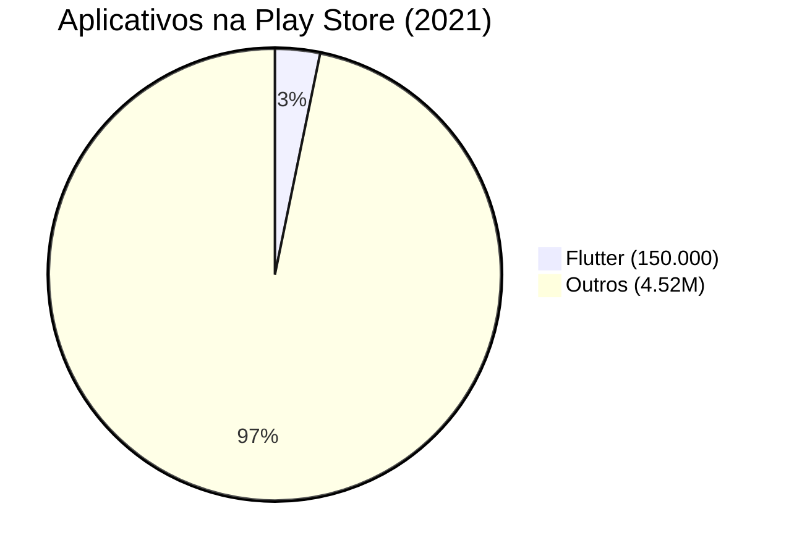

- **2022**: No terceiro trimestre de 2022, o número de aplicativos disponíveis caiu para 3,55 milhões, mas o número de aplicativos Flutter
  cresceu para 500.000, representando cerca de
  14.1% [[1](https://techcrunch.com/2023/05/10/with-over-1m-published-apps-googles-flutter-expands-its-support-for-web-apps-and-webassembly/?guccounter=1#:~:text=Google%20also%20noted%20that%20there,adopt%20Flutter%20in%20existing%20projects.), [2](https://www.statista.com/statistics/289418/number-of-available-apps-in-the-google-play-store-quarter/#:~:text=Google%20Play%3A%20number%20of%20available%20apps%20as%20of%20Q3%202022)].

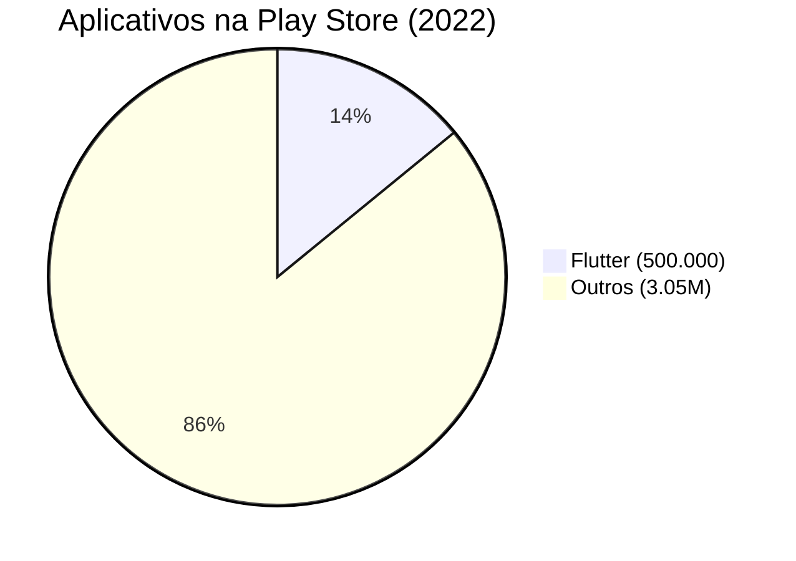

- **2023**: A mais recente contagem disponível indica que há 2,87 milhões de aplicativos na Google Play Store, com mais de 1 milhão baseado
  em Flutter, sugerindo que quase 35% dos aplicativos na loja são desenvolvidos usando essa
  tecnologia [[1](https://bloggersideas.com/pt/apps-statistics/#:~:text=,de%20aplicativos%20dispon%C3%ADveis%20para%20download), [2](https://www.nomtek.com/blog/flutter-app-examples)].

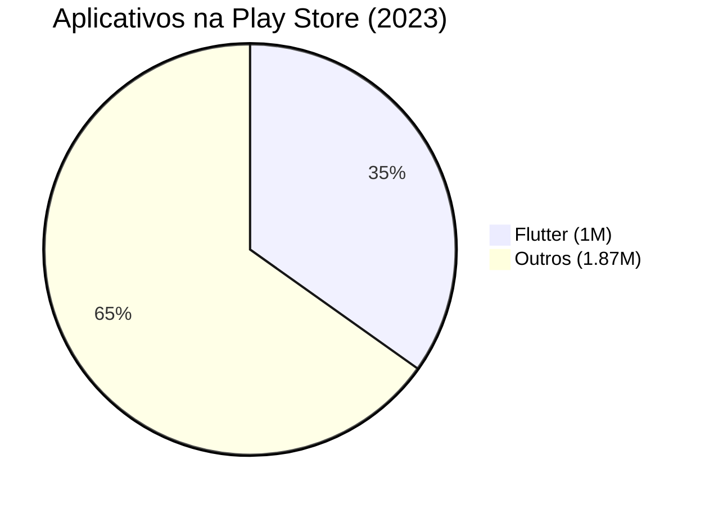

## O que impulsiona a busca por soluções cross-plataforma?

A demanda por soluções cross-plataforma vem do desejo de simplificar o complexo processo de desenvolvimento de aplicativos para múltiplas
plataformas.

A necessidade de dominar linguagens e SDKs diferentes para cada plataforma, como Kotlin para Android e Swift para iOS, além das
constantes atualizações tecnológicas, impõe um grande desafio ao longo prazo.

Frameworks cross-plataforma, como Flutter e React Native, oferecem um caminho mais eficiente, permitindo o uso de um único código-base para
várias plataformas, economizando tempo e esforço significativos.

## Introduzindo o React Native

[React Native](https://github.com/facebook/react-native) é um framework de código aberto que conecta o JavaScript e React com componentes
nativos para Android e iOS.

Essa metodologia é especialmente conveniente para devs com experiência no universo Web/React.

- Um componente `Text` no React Native é convertido em um `UITextView` no iOS.
- No Android, o mesmo componente `Text` se torna um `TextView`.

Atualmente, o React Native possuí 2 tipos de arquiteturas: uma atual e
a [nova](https://reactnative.dev/docs/next/the-new-architecture/landing-page).

### Arquitetura Atual (Estável) do React Native

A arquitetura estável do React Native é baseada em três threads principais:

1. **Thread do JavaScript**: Responsável pela execução do código JavaScript.
2. **Main Thread Nativa**: Ou "thread principal", gerencia a UI e as interações do usuário.
3. **Thread de Background (Shadow Node)**: Administra a criação e manipulação dos nodes.

A comunicação entre o JavaScript e o código nativo é realizada via uma "ponte", que funciona como um terminal de transmissão
de dados, permitindo a desserialização e execução das operações necessárias.

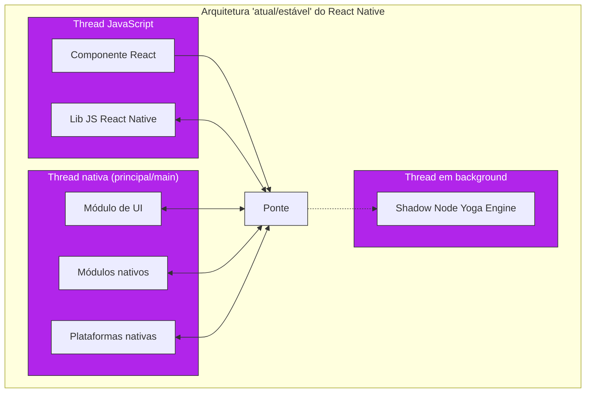

> [🔗 Understanding React Native Architecture](https://dev.to/goodpic/understanding-react-native-architecture-22hh)

#### Desafios da Arquitetura Antiga

1. **Assincronicidade**: a ponte opera de forma assíncrona, causando possíveis atrasos na atualização da UI quando a espera não é
   necessária.
2. **Execução Single-threaded do JavaScript**: restringe todas as computações a uma única thread, podendo causar bloqueios e atrasos em
   operações intensivas.
3. **Overheads de Serialização**: a transferência de dados entre as camadas requer serialização (geralmente em JSON) e desserialização,
   adicionando sobrecarga computacional e afeta o desempenho.

### A Nova arquitetura do React Native

A nova arquitetura do React Native foca em melhorar a comunicação entre as threads, eliminando a necessidade de serialização/desserialização
e utilizando múltiplas threads para aprimorar o desempenho.

#### ⚠️ Fase experimental

Essa nova arquitetura ainda é experimental e está sujeita a mudanças à medida que o projeto evolui.

É importante estar ciente de que a implementação atual inclui várias etapas manuais e não reflete a experiência final de desenvolvimento
prevista para a arquitetura renovada.

#### Principais componentes da nova arquitetura

- **[Fabric](https://reactnative.dev/architecture/fabric-renderer)**: Uma reescrita total da camada de renderização, otimizando a interação
  entre JavaScript e código nativo. O Fabric elimina a necessidade de serialização e desserialização, permitindo atualizações de UI
  imediatas
  e animações mais fluidas, reduzindo simultaneamente a carga computacional geral.
- **JSI (JavaScript Interface, uma interface em JavaScript para código nativo)**: Substitui a ponte tradicional, oferecendo uma camada de
  abstração mais leve que permite chamadas sincronizadas entre JavaScript e código nativo.
- **TurboModules**: Módulos otimizados que usam o JSI para um acesso mais direto e eficiente.
- **React Renderer**: Um novo renderizador que colabora com o JSI para melhorar o desempenho da UI.

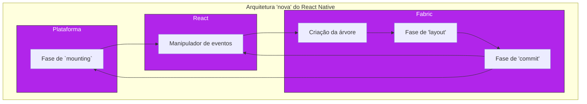

#### Turbo Modules

Os [`TurboModules`](https://reactnative.dev/docs/next/the-new-architecture/pillars-turbomodules) representam uma evolução significativa
dos `NativeModule` no React Native, abordando desafios como a inicialização prematura e a serialização de dados.

Os Turbo Modules oferecem os seguintes benefícios adicionais:

- **Interfaces fortemente tipadas**: As interfaces são consistentes em todas as plataformas, aumentando a confiabilidade e a clareza do
  código.
- **Flexibilidade de linguagem**: Há a opção de escrever seu código em C++, seja exclusivamente ou integrado a outras linguagens de
  plataformas nativas. Isso reduz a necessidade de duplicar implementações em diferentes plataformas.
- **Carregamento preguiçoso (lazy loading)**: Os módulos são carregados conforme a necessidade, contribuindo para um início mais rápido do
  aplicativo.
- **Uso do JSI**: Permite uma comunicação mais eficiente entre o código nativo e o JavaScript, superando as limitações da ponte tradicional.

>
> [🔗 Exploring React Native's new architecture](https://blog.logrocket.com/exploring-react-natives-new-architecture/)
>
> [🔗 A guide to Turbo Modules in React Native](https://dev.to/amazonappdev/a-guide-to-turbo-modules-in-react-native-5aa3)
>
> [🔗 Documentação oficial sobre a nova arquitetura](https://reactnative.dev/docs/next/the-new-architecture/landing-page)

---

## Introduzindo o Flutter

[Flutter](https://github.com/flutter/flutter) é um kit de desenvolvimento de interface de usuário (UI toolkit e framework), de código
aberto, criado pela empresa Google em 2015, baseado na linguagem de programação Dart, que possibilita a criação de aplicativos compilados
nativamente, para os sistemas operacionais Android, iOS, Windows, Mac, Linux, Fuchsia e Web.

Do ponto de vista arquitetural, o Flutter possui três camadas – o framework, a engine e a plataforma – e se baseia em especificidades da
linguagem Dart, como a compilação ahead-of-time (AOT).

Como dev, você interage principalmente com o framework, escrevendo o aplicativo e os widgets (componentes da UI no Flutter) de
maneira declarativa usando Dart.

A engine, então, renderiza isso em uma tela usando o [Skia](https://github.com/google/skia), que é posteriormente enviada às plataformas
nativas: Android, iOS ou web. A plataforma nativa apresenta o canvas e envia os eventos que ocorrem de volta:

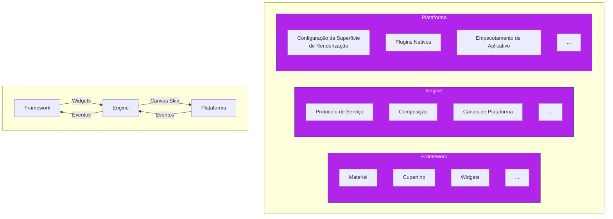

### Flutter vs React Native

Embora a arquitetura do Flutter seja semelhante à do React Native, há uma diferença significativa em termos de desempenho.

Um dos componentes-chave que permite ao Flutter alcançar um desempenho superior ao do React Native é a integração mais profunda com o lado
nativo, o que significa que ele não usa os SDKs tradicionais.

Em vez disso, o Flutter utiliza o Android NDK e o LLVM do iOS para compilar o código C/C++ que vem do engine.

#### Flutter vs a nova arquitetura do React Native

É importante ressaltar que não encontrei material comparando a nova arquitetura do React Native com o Flutter. Fica para um artigo do
futuro!

### Desvantagens do Flutter

Embora o Flutter tenha um desempenho satisfatório, superando o React Native em termos de compilação de Dart para código nativo, ele enfrenta
desafios como o tamanho aumentado dos aplicativos, devido à inclusão de seu motor de execução e widgets.

Além disso, a extensão de funcionalidades não suportadas nativamente pelo Flutter exige a comunicação entre Dart e as linguagens nativas por
meio de canais e estruturas de dados específicas, o que pode ser uma solução menos eficiente e mais complexa em comparação com a
interoperabilidade entre Java e Kotlin ou Objective-C e Swift.

```mermaid
gantt
    title Tamanhos de um app Flutter no Android
    dateFormat X
    axisFormat %s
    section Jetpack Compose
        1.463 MB: 0, 1463
    section KMP Compose
        1.463 MB: 0, 1463
    section Flutter
        5.5MB: 0, 5463
```

```mermaid
gantt
    title Tamanhos de um app Flutter no iOS
    dateFormat X
    axisFormat %s
    section Swift UI
        1,7 MB: 0, 1700
    section Flutter
        17,9 MB (iOS > 12.1): 0, 17900
        25,4MB (iOS < 12.1): 0, 25400
    section KMP Compose
        24,8 MB: 0, 24800

```

> [🔗 Android & iOS native vs. Flutter vs. Compose Multiplatform](https://www.jacobras.nl/2023/09/android-ios-native-flutter-compose-kmp/)

#### O desafio do Dart no Flutter

Como toda linguagem, Dart impõe um desafio natural de aprendizado e aplicação.

Embora o Dart seja uma linguagem moderna e dinâmica, é comum que devs de outras plataformas nativas possam encontrar uma barreira ao
adentrar neste novo ecossistema, como funcionalidades específicas de linguagens como Kotlin ou Swift.

Dart está constantemente se aprimorando e, embora possa não ter a mesma percepção de maturidade que linguagens estabelecidas, ela oferece
uma série de recursos interessantes que estão ganhando reconhecimento na comunidade de
desenvolvimento.

### Considerações finais sobre cross-plataforma

As soluções cross-plataforma abstraem as complexidades nativas, permitindo escrever um único código para diversos dispositivos.

Porém, é comum encontrar limitações ao se integrar com a plataforma nativa, impactando o desempenho e a experiência da aplicação.

Além disso, a adaptação a atualizações das plataformas pode ser lenta, pois o framework cross-plataforma precisa ser atualizado para
suportar novas funcionalidades nativas.

---

## Introduzindo o Kotlin Multiplataforma (KMP)

Para superar esses desafios, o Kotlin Multiplatform (KMP) apresenta uma nova abordagem, centrada na coexistência harmoniosa com o
desenvolvimento nativo.

Em vez de tentar abstrair completamente a plataforma nativa, o KMP empodera devs nativos com um maquinário open-source que trata de
compilar as aplicações para Android, iOS, Web, macOS, Windows, Linux entre outros.

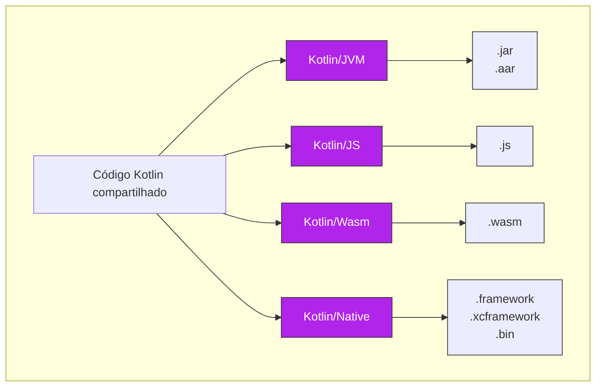

O KMP visa:

- Manter o desenvolvimento de recursos específicos da plataforma tão natural e próximo quanto possível do desenvolvimento nativo.
- Assegurar que os desenvolvedores nativos não enfrentem dificuldades ao trabalhar com o código compartilhado.
- Facilitar a interoperabilidade entre o código nativo e compartilhado, tornando a interação com o código compartilhado intuitiva e
  familiar.

### Compartilhando código Kotlin com as plataformas

Um dos princípios adotados no KMP é: compartilhar o que você quiser, quando você quiser e onde você quiser.

Isso nos permite adotar uma estratégia de refatoração incremental, selecionando um pequeno pedaço do app para compartilhar (como eventos de
analytics), e ir expandindo conforme a experiência do time expande.

#### UI e Infra nativa

Essa é abordagem mais comum no KMP, onde compartilhamos apenas o "cérebro" ou "core" da nossa aplicação.

Aqui, focamos apenas em compartilhar as regras de negócio ou e todas as suas implicações, como acesso ao hardware (localização, internet,
Bluetooth), serialização, deserialização, etc.

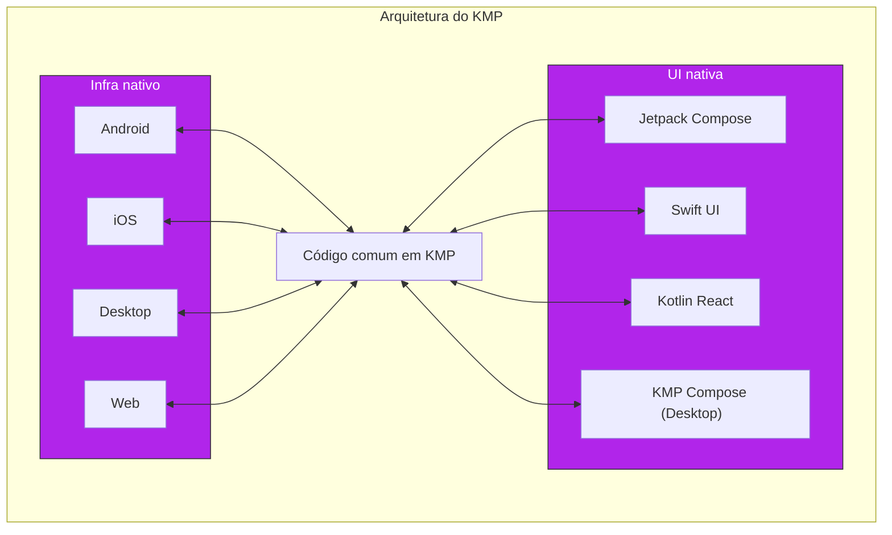

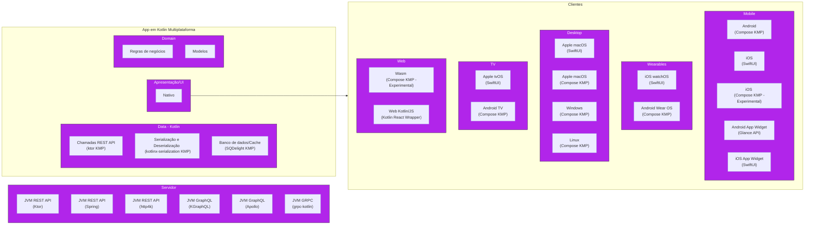

###                                                                                  

Ao explorar o KMP, podemos nos beneficiar da eficiência do código compartilhado sem sacrificar a qualidade da experiência nativa. 
